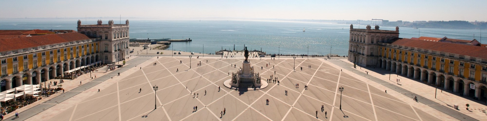
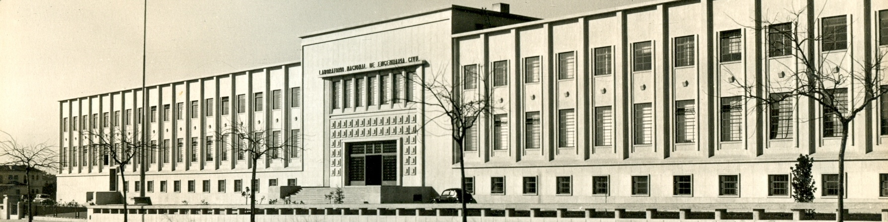
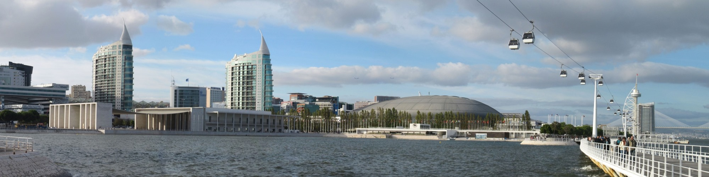

<!--  Camera JS with Required jQuery Easing Plugin-->

<!-- Bootstrap Js -->

<link href="{{ site.baseurl }}/css/camera.css" rel="stylesheet">

        <!--Camera Slide-->    
         
                  
            

                
            
                       
            

                                                
                

                    17CNG: LNEC - Av. do Brasil 101, Lisboa
                

            
  
            

                
                

                    Praça do Comércio, Lisboa
                
                               
            
                        
            

                
            
                                   
            

                                
                

                    LNEC-DG: Edifício Calouste Gulbenkian
                
                
            
            
            

                                
                

                    Parque Eduardo VII, Lisboa
                
                
            
            
             

                
            
                          
            

                                
                

                    Campus do LNEC (Google 3D)
                
                
            
                       
            

                             
                

                    Santa Maria de Belém, Lisboa
                
           
            
      
             

                
            
                               
            

                
                

                    LNEC na década de 50
                

            
  
            

                
                

                    Parque das Nações, Lisboa
                

            
  
         
   <!--------Camera Slide End-->

  
 

# Convite

A Sociedade Portuguesa de Geotecnia ([SPG](http://www.spgeotecnia.pt)) e o Laboratório Nacional de Engenharia Civil ([LNEC](http://lnec.pt)) organizam o 17º Congresso Nacional de Geotecnia (**17CNG**). 
O Congresso decorrerá em Lisboa, nas instalações do LNEC, de 3 a 6 de maio de 2020. 
Na mesma ocasião, a 4 de maio de 2020, decorrerá o 10º Congresso Luso-Brasileiro de Geotecnia (**10CLBG**), organizado pela SPG, a Associação Brasileira de Mecânica dos Solos e Engenharia Geotécnica ([ABMS](http://www.abms.com.br)) e o LNEC. 
No dia 3 de maio de 2020 haverá também lugar ao 11º Encontro de Jovens Geotécnicos (**11EJG**).

O evento será organizado em sessões plenárias, com conferências proferidas por especialistas nacionais e estrangeiros, 
e sessões técnicas, com apresentação de comunicações selecionadas. 
As conferências e as comunicações serão disponibilizadas em formato digital.

Durante as sessões decorrerá ainda uma exposição técnica, na qual se conta com a participação de instituições e empresas. 
No último dia do Congresso estão programadas visitas técnicas. 
Os dias das sessões incluirão almoço a que acresce a realização de outros eventos sociais a divulgar oportunamente.

## <i class="fa fa-newspaper-o"></i> Notícias




## <i class="fa fa-calendar-o"></i> Calendar

<iframe src="https://calendar.google.com/calendar/embed?title=ACM%20SIGCOMM%20Agenda&amp;showTitle=0&amp;showPrint=0&amp;showCalendars=0&amp;mode=AGENDA&amp;height=600&amp;wkst=1&amp;hl=en&amp;bgcolor=%23ffffff&amp;src=fgkdoih822v80dfk304pt56fjo%40group.calendar.google.com&amp;color=%23125A12&amp;ctz=America%2FSao_Paulo" style="border-width:0" width="100%" height="400" frameborder="0" scrolling="no"></iframe>



## <i class="fa fa-calendar"></i> Datas importantes



## <i class="fa fa-gg"></i> Organização

	
	  
  

